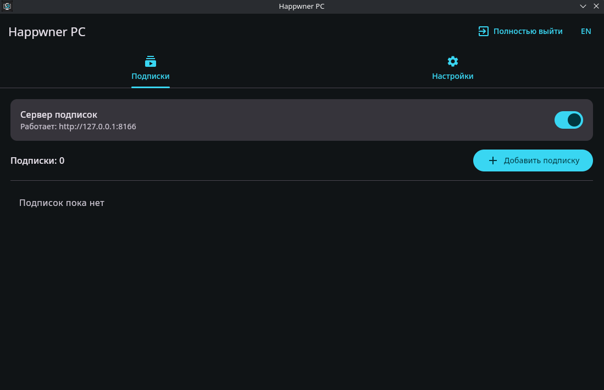
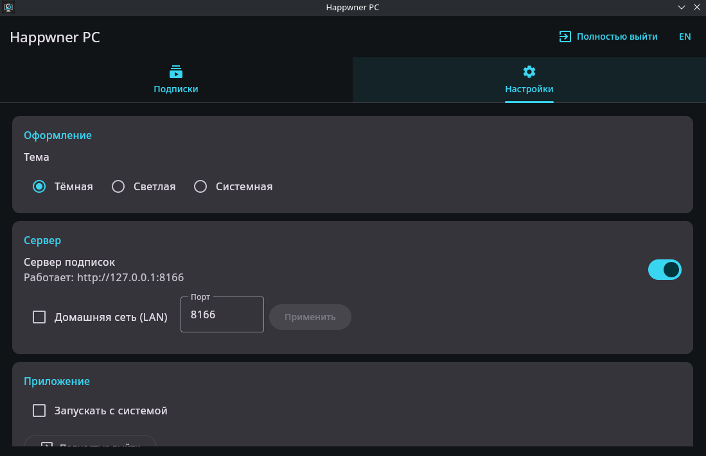

<p align="center">
  
</p>

<h1 align="center">Happwner PC</h1>

<p align="center">
  Локальный сервер подписок для компьютера и всей домашней сети
</p>

<p align="center">
  
  
  
  
  <a href="https://github.com/Kasumicic/Happwner_PC/actions/workflows/ci.yml"></a>
</p>

<p align="center">
  <b>Русский</b> · <a href="README.md">English</a> ·
  <a href="docs/RELEASE_0.1.6_RU.md">Что нового</a> ·
  <a href="docs/CORE_AUDIT_RU.md">Аудит ядра</a> ·
  <a href="docs/CLIENT_COMPATIBILITY_RU.md">Совместимость клиентов</a>
</p>

> [!IMPORTANT]
> **0.1.6** — первый стабильный публичный релиз. В него входят сборки Linux и Windows, безопасная диагностика, копирование готовых профилей, сведения о трафике и сроке подписки, а также надёжное преобразование подписок.

Happwner PC получает подписку у провайдера, расшифровывает и преобразует её, а затем отдаёт по постоянной локальной ссылке. Эту ссылку можно использовать в VPN-клиенте на том же компьютере или раздать телефонам, телевизорам и другим устройствам в доверенной домашней сети.

Проект является некоммерческим настольным форком Android-приложения [Happwner](https://github.com/Omegaplexx/Happwner). Android, Xposed и LSPatch-функции удалены — осталось переносимое ядро расшифровки, преобразования и «Мост» подписок.

## Как это выглядит

### Подписки

<p align="center">
  
</p>

### Настройки

<p align="center">
  
</p>

## Главное

- **Локально или по всему дому.** Безопасный режим `127.0.0.1` включён по умолчанию; LAN-режим активируется отдельно.
- **Постоянные ссылки.** Адрес вида `http://127.0.0.1:8166/sub/<UUID>` не меняется при обновлении исходной подписки.
- **Форматы Happ и других клиентов.** Поддерживаются HTTP(S), `happ://add`, `happ://crypt`–`crypt5`, `v2raytun://crypt`, `v2raytun://import`, `incy://add` и `incy://import`.
- **Совместимость с провайдерами.** Передаются `x-hwid` и выбранный `User-Agent`, обрабатывается заголовок `Encrypt-Tag`.
- **Преобразование профилей.** Доступны Base64, JSON → URI и Xray → sing-box; Base64-декодирование включено по умолчанию.
- **Проверка подписок.** Приложение показывает HTTP-статус, размер ответа, найденные профили, протоколы и понятную ошибку обработки.
- **Трафик и срок действия.** Данные `Subscription-Userinfo` показывают использованный и оставшийся трафик, лимит и дату окончания подписки.
- **Копирование профилей.** Можно получить, расшифровать, преобразовать и сразу скопировать полное содержимое готовой подписки без импорта её URL.
- **Безопасная диагностика.** Журнал в памяти показывает клиентов, время обработки, параметры ответа и преобразования; в скопированном отчёте адреса маскируются, а секреты подписки отсутствуют.
- **Удобство на ПК.** Тёмная тема, вкладки, QR-коды LAN-ссылок, генерация HWID, системный трей, автозапуск и нормальная работа буфера обмена.
- **Диагностика сети.** Можно выбрать LAN-интерфейс и увидеть процесс/PID, занявший нужный порт.

## Быстрый старт

Для сборки нужен JDK 21. В готовый пакет Java уже включена.

### Arch Linux

```bash
sudo pacman -S --needed jdk21-openjdk base-devel
make arch
sudo pacman -U dist/happwner-pc-bin-0.1.6-3-x86_64.pkg.tar.zst
```

После установки Happwner PC появится в меню приложений. Запуск из терминала:

```bash
happwner-pc
```

### Другие дистрибутивы Linux

Универсальный переносимый архив:

```bash
make linux
tar -xzf dist/happwner-pc-0.1.6-linux-$(uname -m).tar.gz
./Happwner\ PC/bin/Happwner\ PC
```

Для Debian/Ubuntu:

```bash
make deb
sudo apt install ./dist/happwner-pc_0.1.6_amd64.deb
```

Точное имя DEB может немного отличаться — `make artifacts` покажет созданные файлы. Все цели доступны через `make help`.

Для Fedora/openSUSE:

```bash
make rpm
```

Чтобы проверить проект и собрать portable-архив, DEB, RPM и Arch-пакет одной командой:

```bash
sudo pacman -S --needed base-devel dpkg rpm-tools
make release
```

Готовые к прикреплению в GitHub Release файлы, release notes и `SHA256SUMS` появятся в `release/`. Эта папка не отслеживается Git.

### Запуск из исходников

```bash
make run
make test
```

## Использование

1. Нажмите **«Добавить подписку»** и укажите исходную ссылку.
2. При необходимости задайте HWID и User-Agent или сгенерируйте новый HWID.
3. Нажмите **«Проверить»**, чтобы убедиться, что ответ содержит профили.
4. Скопируйте локальный адрес и добавьте его в NekoBox, Hiddify, v2rayNG или другой совместимый клиент либо нажмите **«Скопировать профили»**, чтобы поместить в буфер полный обработанный ответ.
5. Чтобы пользоваться подпиской с других устройств, включите **«Домашняя сеть (LAN)»** и импортируйте ссылку через QR-код.

Сервер по умолчанию слушает только `127.0.0.1:8166`. Если другое устройство не открывает `/health`, разрешите входящие TCP-подключения к выбранному порту в брандмауэре.

Ручная проверка на Android подтвердила работу LAN-ссылок в Exclave, Husi, Happ и NekoBox. Incy отклоняет такую ссылку из-за собственного запрета незашифрованного HTTP (`CLEARTEXT`). Результаты и объяснение собраны в [таблице совместимости клиентов](docs/CLIENT_COMPATIBILITY_RU.md).

## Безопасность

LAN-режим работает без авторизации. Любой участник локальной сети, получивший адрес `/sub/<UUID>`, сможет скачать соответствующую конфигурацию. Включайте его только в доверенной домашней сети и **не открывайте порт в Интернет**.

Старые ссылки с произвольным исходным URL принимаются только с loopback-адреса, поэтому устройства в LAN не могут использовать приложение как произвольный HTTP-прокси.

Настройки хранятся в `%APPDATA%/HappwnerPC` на Windows и `${XDG_CONFIG_HOME:-~/.config}/happwner-pc` на Linux.

Скопированные профили содержат данные подключения. Считайте содержимое буфера обмена секретным и очищайте его историю после вставки в доверенный клиент.

## Состояние релиза

Криптографические алгоритмы, форматы ссылок и основной HTTP-конвейер сверены с Android-оригиналом и покрыты автоматическими тестами. Осознанные отличия ПК-версии перечислены в [аудите ядра](docs/CORE_AUDIT_RU.md).

Первый стабильный релиз готов. Дальнейшая работа над совместимостью включает:

- продолжить проверку других версий и клиентов, включая Hiddify, v2rayNG и Karing;
- провести smoke-тест трея и автозапуска в Windows, GNOME и других Linux DE;
- добавить инструкции для популярных брандмауэров.

Актуальный список работ находится в [TODO.md](TODO.md).

## Разработка

```bash
./gradlew test
./gradlew :desktop:createDistributable
```

GitHub Actions запускает тесты в Linux и Windows при каждом push в `main` и для каждого pull request. Workflow **Release builds** собирает переносимые архивы Linux и Windows, пакеты DEB, RPM, Arch Linux и MSI. При отправке тега вида `v*` файлы публикуются автоматически; ручной запуск только сохраняет артефакты workflow, пока не включён флаг **Upload artifacts to the GitHub Release** и не указан нужный тег.

Проект разделён на два модуля:

- `core` — форматы ссылок, криптография и конвертеры;
- `desktop` — Compose Desktop, HTTP-сервер, хранилище, трей и автозапуск.

## Авторы и условия

Криптографическое и конвертирующее ядро основано на работе **Omegaplex** и **slavrom21** в исходном проекте Happwner.

Разрешается некоммерческое использование, копирование, изменение и распространение при сохранении указания авторов и ссылки на [исходный проект](https://github.com/Omegaplexx/Happwner). Коммерческое использование требует разрешения автора оригинального проекта.

Программа предназначена для личного использования собственных подписок и их раздачи близким в пределах доверенной сети. Авторы не несут ответственности за действия пользователя.
